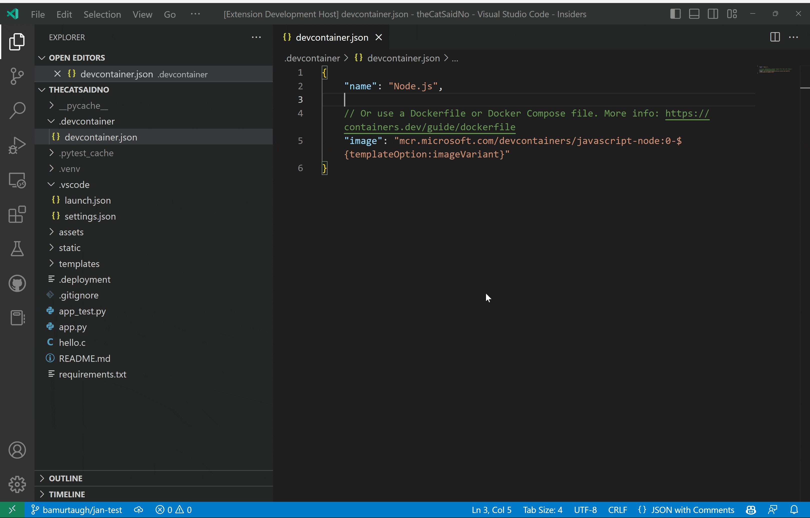

# Dev container "image" converter

This is a simple extension to convert the "image" property in a devcontainer.json to a Dockerfile.

## Running the extension

- Clone the repo: `git clone https://github.com/bamurtaugh/devcontainer-image-convert`
- Open the repo in VS Code (stable or insiders): `code devcontainer-image-convert` or `code-insiders devcontainer-image-convert`
- Open VS Code terminal, run `npm install`
- `F5` to run the extension

## Development status

This extension is under active development. Items left to be investigated or implemented are designated with `TODO` in [extension.ts](./src/extension.ts). Here are the main ones:

1.  Replace the `"image"` property in devcontainer.json with `"build": "."`
2. Better handle if Dockerfile already exists (rather than silently failing
     - Give option to cancel or overwrite, and overwrite will replace existing contents rather than write same FROM contents again
3. Open the Dockerfile automatically after creation (or provide an extension setting to open Dockerfile automatically)

## Code Action Provider Sample

This extension is based off the Visual Studio Code [Code Action Provider sample extension](https://github.com/microsoft/vscode-extension-samples/tree/main/code-actions-sample), which shows how to provide code actions in the editor. Code actions are used to implement quick fixes and [refactoring](https://code.visualstudio.com/docs/editor/refactoring) in VS Code.

## License

The Code Action Provider sample has the following license:
- Copyright (c) Microsoft Corporation. All rights reserved.
- Licensed under the [MIT](https://github.com/microsoft/vscode-extension-samples/blob/main/LICENSE) License.

You can find the license for this extension in this repo's [LICENSE.md](./LICENSE.md).

## Contributing

Please feel free to contribute changes to this extension via [issues](https://github.com/bamurtaugh/devcontainer-image-convert/issues) or [PRs](https://github.com/bamurtaugh/devcontainer-image-convert/pulls) in this repo.